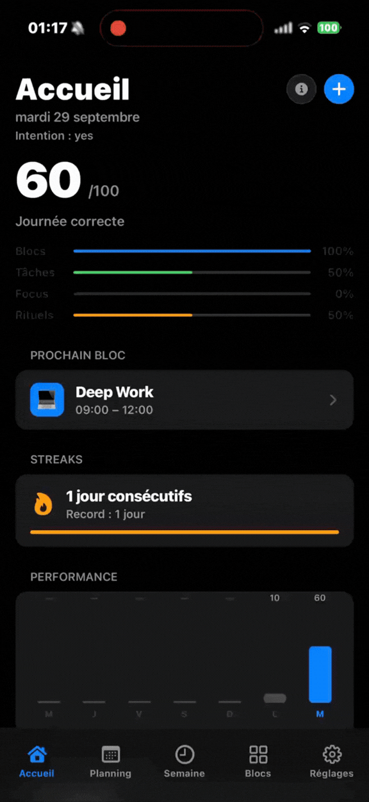
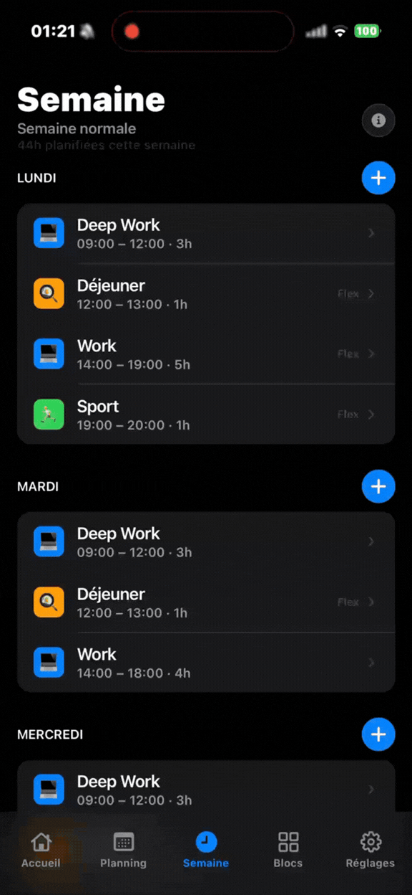
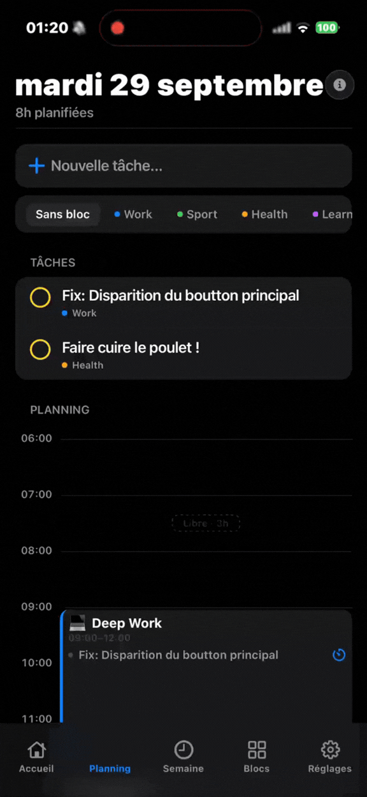
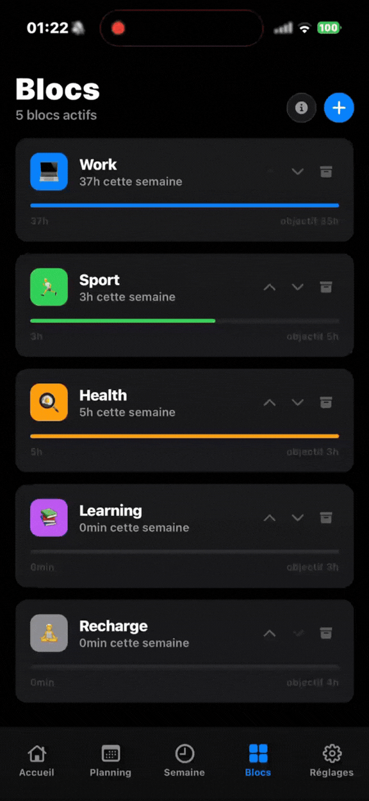

# Flowday

Flowday is a personal planning mobile application built with React Native and Expo.

> **Portfolio and learning project**: I am currently a second-year student, and this repository reflects my learning journey with React Native. It is not a commercial product or a finished application.

## Showcase

<table>
  <tr>
    <td width="55%" valign="middle">
      <h3>Planning your day</h3>
      <p>
        Flowday was created to help organize a day around tasks, life blocks and
        weekly routines. The application combines daily planning, a weekly
        template, focus sessions and morning and evening rituals in one mobile
        experience.
      </p>
      <p>
        The goal is to make planning feel simple and focused rather than turning
        it into another complicated tool. Data is stored locally, so the
        application can be used without a backend or an account.
      </p>
      <h3>My learning process</h3>
      <p>
        The project was built progressively with the help of simple tutorials,
        online documentation, personal research and experimentation with the
        technologies involved. I did not build every part only from prior
        knowledge. This repository shows how I learn, investigate problems and
        turn what I discover into a working application.
      </p>
    </td>
    <td width="45%" align="center" valign="middle">
      
    </td>
  </tr>
</table>

## Features

<table>
  <tr>
    <td width="33%" align="center" valign="top">
      
      <h3>Weekly planning</h3>
      <p>
        Create a weekly template with time blocks for each day. The template is
        then used to build the daily planning view.
      </p>
    </td>
    <td width="33%" align="center" valign="top">
      
      <h3>Daily timeline</h3>
      <p>
        View the day hour by hour, add tasks, associate them with life blocks and
        follow the current time on the timeline.
      </p>
    </td>
    <td width="33%" align="center" valign="top">
      
      <h3>Life blocks</h3>
      <p>
        Organize activities into meaningful areas such as work, sport, health or
        learning, with colors and weekly objectives.
      </p>
    </td>
  </tr>
</table>

Other features include:

- Block validation (done, partial or skipped) and lived time per life block.
- Tasks with priorities, completion tracking, rescheduling and undo on delete.
- Daily score and streak tracking.
- Morning Ritual and Evening Wrap workflows.
- Focus mode with Pomodoro sessions.
- First-launch onboarding with starter life blocks.
- Local notifications for rituals, block starts and the end of a Pomodoro.
- French and English, switchable in the settings.
- Light and dark themes.
- Haptic feedback and reusable mobile components.
- Versioned local persistence with AsyncStorage and a migration chain.
- JSON export of all local data.

## Getting started

### For visitors

You can explore the project directly on GitHub through the demonstrations and source code. No Flowday account is required because the application currently stores data locally on the device.

To run the application on a phone with Expo Go, you need a free Expo account. This is an Expo development requirement, not an account created for Flowday. The same Expo account may need to be signed in on both the terminal and the Expo Go application.

### Prerequisites

- [Node.js](https://nodejs.org/) v22 or newer
- [Expo Go](https://expo.dev/go) on an iPhone or Android device
- A free [Expo account](https://expo.dev/signup)

### Installation

```bash
git clone https://github.com/PayExe/Flowday.git
cd Flowday
npm install
npx expo start
```

You can then:

- press `w` to open the web version;
- scan the QR code with Expo Go to open the application on a mobile device.

Depending on the Expo SDK version, Expo Go may require the terminal and the mobile application to use the same Expo account.

## Technologies

- React Native
- Expo SDK 57
- Expo Router
- Zustand
- AsyncStorage
- Vitest

## What I learned

This project helped me practice:

- building mobile interfaces with React Native;
- managing navigation with Expo Router;
- structuring an application by features;
- managing global state with Zustand;
- persisting data locally with AsyncStorage;
- creating reusable components and themes;
- writing unit tests for application logic;
- using GitHub Actions to automate quality checks.

The architecture and design decisions will continue to evolve as I improve my understanding of the technologies.

## Current scope and future improvements

Flowday is still an educational project under development. The current version focuses on local usage and does not include user accounts, cloud synchronization or a backend.

Possible future improvements include:

- improving accessibility and automated UI testing;
- adding cloud synchronization;
- adding a restore path for the exported data;
- showing planned versus lived time per life block over a week and a month;
- refining the focus and planning workflows;
- publishing a production build.


## Known limitations

- The application is a test version and stores data locally on the device.
- There is no account, cloud synchronization, backend or data recovery flow.
- Automated coverage focuses on stores and business logic; full device UI and accessibility testing is still limited.
- `npm audit` currently reports transitive dependency vulnerabilities. Some fixes require breaking upgrades to Expo Router, Vitest or Expo, so they are not applied automatically with `--force`.

## Learning resources

- [Expo documentation](https://docs.expo.dev/)
- [React Native documentation](https://reactnative.dev/docs/getting-started)
- [Tutorial that helped me start the project](https://youtu.be/m1-bc53EGh8?si=xLnjeSeY1BLpS7Zs)

## License

This project is distributed under the [Creative Commons Attribution-
NonCommercial 4.0 International License (CC BY-NC 4.0)](LICENSE). Commercial
use, including selling the project or incorporating it into a paid product or
service, is not permitted.
